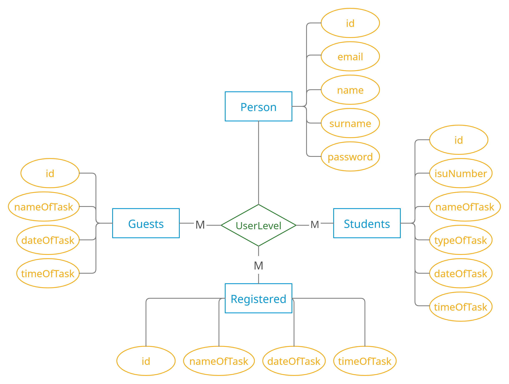
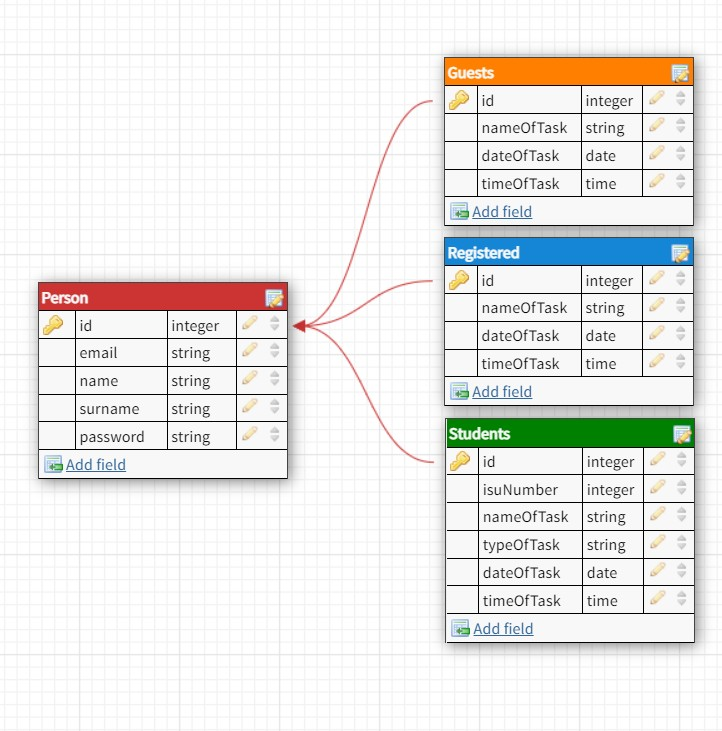

| Сущность | Свойство | Комментарий |
| :---: | :---: | :---: |
| Person | id | Идентификационный номер пользователя |
|        | UserLevel | Уровень пользователя |
|        | email | Почта пользователя |
|        | name | Имя пользователя |
|        | surname | Фамилия пользователя |
|        | password | Пароль для входа(если не гость) |
| Guest | id | Идентификационный номер пользователя |
|       | nameOfTask | Название задачи |
|       | dateOfTask | Дата, на которую закрепляется, задача |
|       | timeOfTask | Время задачи |
| Registered | id | Идентификационный номер пользователя |
|            | nameOfTask | Название задачи |
|            | dateOfTask | Дата, на которую закрепляется, задача |
|            | timeOfTask | Время задачи |
| Students | id | Идентификационный номер пользователя |
|          | isuNumber | Номер ИСУ |
|          | nameOfTask | Название задачи |
|          | typeOfTask | Тип задачи (расписание или таска) |
|          | dateOfTask | Дата, на которую закрепляется, задача |
|          | timeOfTask | Время задачи |

